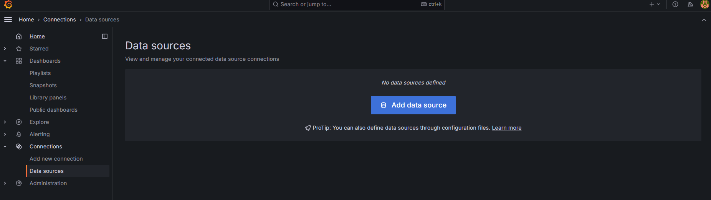
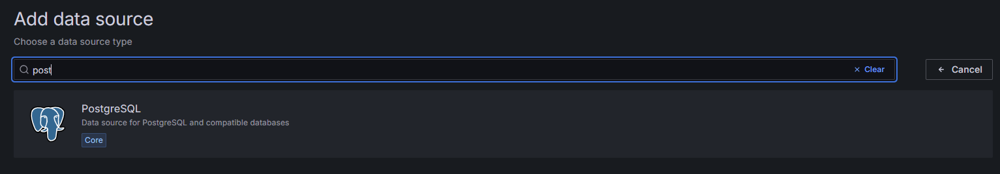
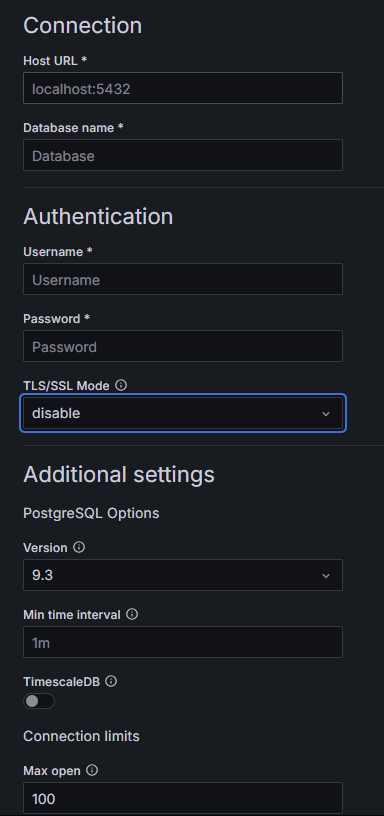

# Pyspark

## 1.Arrancar servicios

### PySpark Cluster

```
docker compose up -d spark-master spark-worker
```

### Instalar pyspark 3.5.1 en uno de los contenedores

```
docker exec -it spark-master pip3 install pyspark==3.5.1 
```

### Iceberg

```
docker compose up -d minio
```

### kafka

```
docker compose up -d redpanda-0 console
```

### Ksqldb

```
docker compose up -d ksqldb-server ksqldb-cli
```

## 2. Querys Spark

### 2.1 Query Mongo

```
docker exec -it spark-master python3 /opt/spark-apps/src/mongo.py
```

### 2.2 Query PostgreSQL

```
docker cp jars/postgresql-42.7.3.jar spark-master:/opt/bitnami/spark/jars
```

```
docker exec -it spark-master python3 /opt/spark-apps/src/Postgres.py
```

### 2.3 Query Iceberg

```
docker exec -it spark-master python3 /opt/spark-apps/src/Write_Iceberg.py.py
```

```
docker exec -it spark-master python3 /opt/spark-apps/src/Read_Iceberg.py.py
```

### 2.3 Query kafka

```
docker exec -it spark-master python3 /opt/spark-apps/src/kafka.py
```

## 3. Streaming

```
docker exec -it ksqldb-cli ksql http://ksqldb-server:8088
```

## 4. Grafana

### 4.1 New Data Source



Añadimos una BBDD tipo Postgres



Configuramos


