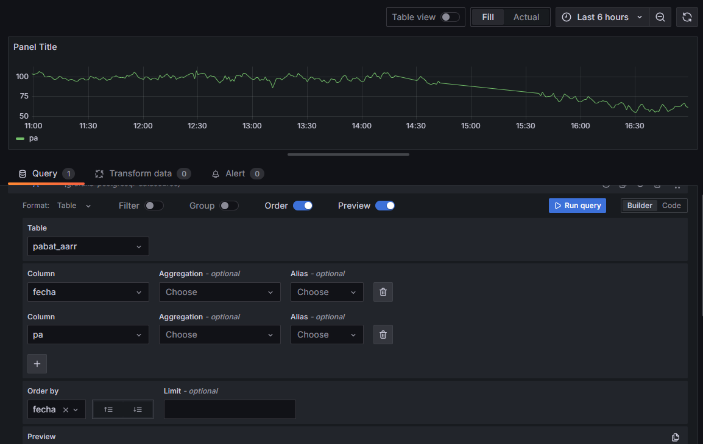

# Readme

## 0. Servicios

| Servicio | Descripcion | GUI |
| ------------- |:-------------:| :-----:|
| redpanda-0 | kafka | [kafka console](http://localhost:8989) |
| spark-master | spark | [spark cluster](http://localhost:8989) |
| Minio | S3 | [minio](http://localhost:9091) |
| jupyter | jupyter-notebook | [jupyter-notebook](http://localhost:8989) |
| grafana | grafana | [grafana](http://localhost:3000) |
| ksqldb-server | ksqldb |  |
| PostgreSQL | PostgreSQL |  |
| Nessie | Nessie | [nessie](http://localhost:19120) |
| Dremio | Apache Dremio | [dremio](http://localhost:9047) |

## 1.Arrancar servicios

### 1.1 PySpark Cluster

```
docker compose up -d spark-master spark-worker
```

#### 1.1.1 Configurar Spark

```
docker exec -it spark-master pip3 install pyspark==3.5.1 
```

```
docker cp jars/postgresql-42.7.3.jar spark-master:/opt/bitnami/spark/jars
```

### 1.2 Iceberg

```
docker compose up -d minio
```

### 1.3 kafka

```
docker compose up -d redpanda-0 console
```

### 1.4 Ksqldb

```
docker compose up -d ksqldb-server ksqldb-cli
```

### 1.5 Jupyter Notebook

```
docker compose up -d jupyter
```

### 1.6 Grafana

```
docker compose up -d grafana
```

### 1.7 Postgres

```
docker compose up -d postgres
```

### 1.8 Dremio & Nessie

```
docker compose up -d dremio nessie
```

## 2. Querys Spark

### 2.1 Query Mongo

```
docker exec -it spark-master python3 /opt/spark-apps/mongo.py
```

### 2.2 Query PostgreSQL

```
docker exec -it spark-master python3 /opt/spark-apps/Postgres.py
```

### 2.3 Query Iceberg

```
docker exec -it spark-master python3 /opt/spark-apps/Write_Iceberg.py.py
```

```
docker exec -it spark-master python3 /opt/spark-apps/Read_Iceberg.py.py
```

### 2.4 Query kafka

```
docker exec -it spark-master python3 /opt/spark-apps/kafka.py
```

### 2.5 Query CockroachDB

```
docker exec -it spark-master python3 /opt/spark-apps/CockroachDB.py
```

## 3. Streaming

```
docker exec -it ksqldb-cli ksql http://ksqldb-server:8088
```

[guia streaming](https://github.com/fjreig/Pyspark/blob/main/stream.md)

## 4. Grafana

### 4.1 New Data Source


Añadimos una BBDD tipo Postgres


Configuramos SSL disable


### 4.2 Nuevo Panel

> [!WARNING]
> Hay que eliminar el limite de filas y ordenar siempre por fecha




## 5. Dremio

### 5.1 Configurar Catalogo Nessie
General settings tab
* Source Name: nessie
* Nessie Endpoint URL: http://nessie:19120/api/v2
* Auth Type: None

Storage settings tab
* AWS Root Path: warehouse
* AWS Access Key: admin
* AWS Secret Key: password
* Uncheck “Encrypt Connection” Box (since we aren’t using SSL)
* Connection Properties
**  Key: fs.s3a.path.style.access | Value: true
**  Key: fs.s3a.endpoint | Value: minio:9000
**  Key: dremio.s3.compat | Value: true
